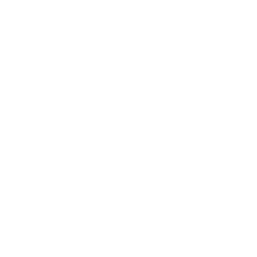

# Ricavi

<div> 
  
</div>

## Tabela de Conteúdo

- [O que é o Projeto?](#o-que-é-o-projeto?)
- [Tecnologias](#tecnologias)
- [Como clonar](#como-clonar)
- [Como inicializar o projeto](#como-inicializar-o-projeto)
- [Inicializar](#inicializar)
- [Precificação](#precificação)
- [Equipe de desenvolvedores](#equipe-de-desenvolvedores)

## O que é o Projeto?

Ricavi é um app de onde possui listas de receitas culinárias com autenticação obrigatória. Esta aplicação foi desenvolvida pela equipe PirateDevs.


## Tecnologias

<div>
    
    
    
    
    
    
     
</div>

## Como Clonar

Para clonar o repositório do MeatGolden, você pode seguir os passos abaixo:

1. No terminal, clone o projeto usando este comando:
```bash
git clone https://github.com/gustavinxd/Ricavi.git
```
2. Depois de clonado, acesse o diretório do projeto usando o comando a seguir
```bash
cd MeatGolden
```

## Como inicializar o projeto

Antes de inicializar o projeto, deve se conferir se possui os seguintes pré requisitos para inicializa-lo:

1. Certifique-se de ter o Git instalado em sua máquina. Você pode verificar se o Git está instalado executando o seguinte comando no terminal:

```bash
git --version
```

Se o Git não estiver instalado, você pode baixá-lo em https://git-scm.com/.

2. Node.js e npm (Node Package Manager): Você precisará do Node.js para executar o ambiente de desenvolvimento do React Native. Você pode baixar o Node.js em https://nodejs.org/. O npm geralmente é instalado automaticamente com o Node.js.

Verifique se o Node.js e o npm estão instalados corretamente usando os comandos:

```bash
node --version
npm --version
```

3. Expo CLI: Para criar e gerenciar projetos Expo, você deve instalar o Expo CLI globalmente. Você pode fazer isso executando o seguinte comando:
   
```bash
npm install -g expo-cli
```
Certifique-se de que o Expo CLI está instalado corretamente:
```bash
expo --version
```
4. Certifique-se que tenha instalado em seu dispositivo o app Expo Go, para executar o projeto diretamente em seu dispositivo. Também é possível executar o app diretamente de uma máquina potente contendo um emulador mobile. Você pode baixar o Android Studio e configurar um Emulador para testar em https://developer.android.com/studio.

### Inicializar

Após conferir os pré-requisitos e estar no diretório do projeto, você deve seguir os seguintes passos:

1. Baixe as dependências do projeto executando o seguinte comando:
   
```bash
npm install
```

2. Após instalar as dependências, execute o projeto com o comando:
   
```bash
npx expo start --tunnel
```
Ao executar o comando, o terminal retornará um QR Code para escanear em seu dispositivo móvel com o app Expo Go e com outras opções a serem escolhidas.

## Precificação

Após uma análise detalhada do projeto e considerando os padrões do mercado, chegamos à seguinte estrutura de precificação para o nosso aplicativo de receitas, que inclui funcionalidades como login, cadastro e acesso a uma variedade de receitas.

### Taxa Horária de Desenvolvimento:

Com base no valor médio de mercado, estabelecemos uma taxa horária de R$ 100. Este valor é uma estimativa para desenvolvedores com habilidades intermediárias no Brasil e é consistente com as taxas praticadas no setor.

### Tempo Total de Desenvolvimento:
O projeto envolveu a colaboração de 3 desenvolvedores, cada um dedicando 16 horas ao desenvolvimento. Portanto, o tempo total de desenvolvimento foi de 48 horas (3 desenvolvedores x 16 horas).

### Custo de Desenvolvimento:
Multiplicando a taxa horária pelo tempo total, o custo de desenvolvimento é calculado como R$ 4.800 (R$ 100/hora x 48 horas).

### Margem de Lucro:
Para garantir a sustentabilidade do projeto, adicionamos uma margem de lucro de 20%. Isso totaliza R$ 960 (20% de R$ 4.800).

### Custo Final do Projeto:
Somando o custo de desenvolvimento e a margem de lucro, o custo final do projeto é de R$ 5.760 (R$ 4.800 + R$ 960).

### Observações Adicionais:
Vale ressaltar que esta é uma precificação básica. Outras despesas, como licenças de software, hardware, custos de manutenção, marketing e operacionais, não estão incluídas neste cálculo.
A complexidade do aplicativo, recursos adicionais, design, testes e suporte pós-lançamento podem influenciar o custo final.

Esta precificação foi cuidadosamente calculada para refletir tanto o esforço investido no projeto quanto a realidade do mercado atual para este tipo de desenvolvimento de software.

## Equipe de Desenvolvedores

- Gustavo Benjamin (github: gustavinxd)
- Edgard Domingues (github: vilaopvp1)
- Ana Alice (github: AnaByo)

